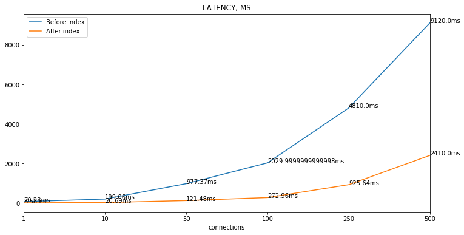
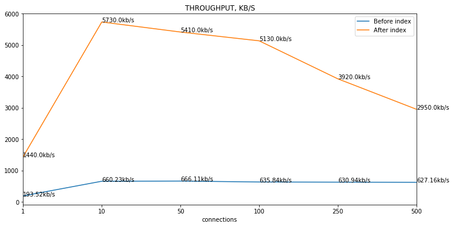

### Latency



### Throughput



### Indexes

```SQL
>>> CREATE INDEX first_name_index ON user(`first_name`);
>>> CREATE INDEX last_name_index ON user(`last_name`);
```

### Explain

```SQL
>>> EXPLAIN FORMAT=JSON
SELECT id, first_name, last_name FROM user WHERE first_name LIKE 'ant%' OR last_name LIKE 'ant%';
```

```json
EXPLAIN: {
  "query_block": {
    "select_id": 1,
    "table": {
      "table_name": "user",
      "access_type": "index_merge",
      "possible_keys": ["first_name_index", "last_name_index"],
      "key_length": "770,770",
      "index_merge": {
        "sort_union": {
          "range": {
            "key": "first_name_index",
            "used_key_parts": ["first_name"]
          },
          "range": {
            "key": "last_name_index",
            "used_key_parts": ["last_name"]
          }
        }
      },
      "rows": 6176,
      "filtered": 100,
      "attached_condition": "`user`.first_name like 'ant%' or `user`.last_name like 'ant%'"
    }
  }
}
```
