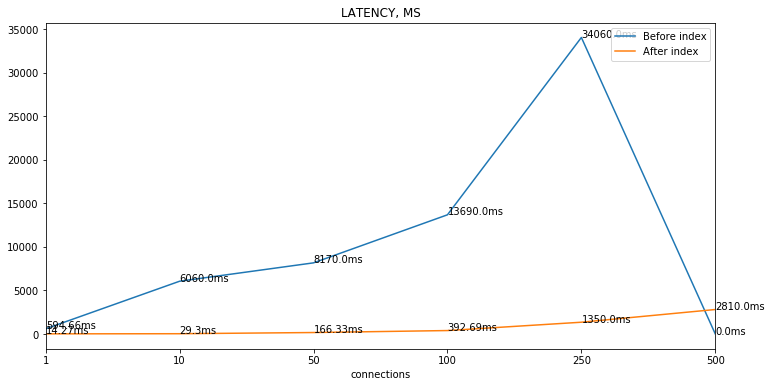
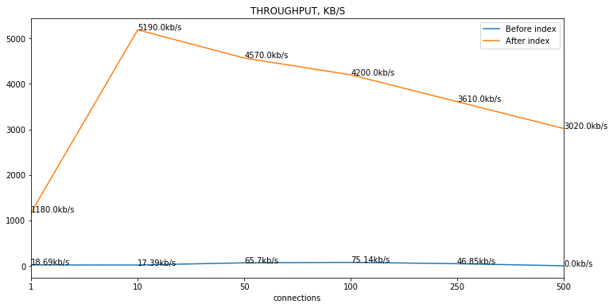

### Latency



### Throughput



### Indexes

```SQL
>>> CREATE INDEX first_name_index ON user(`first_name`);
>>> CREATE INDEX last_name_index ON user(`last_name`);
```

### Explain

```SQL
>>> EXPLAIN FORMAT=JSON
SELECT id, first_name, last_name FROM user WHERE first_name LIKE 'ant%'
UNION ALL
SELECT id, first_name, last_name FROM user WHERE last_name LIKE 'ant%' AND NOT first_name LIKE 'ant%';
```

```json
EXPLAIN: {
  "query_block": {
    "union_result": {
      "table_name": "<union1,2>",
      "access_type": "ALL",
      "query_specifications": [
        {
          "query_block": {
            "select_id": 1,
            "table": {
              "table_name": "user",
              "access_type": "range",
              "possible_keys": ["first_name_index"],
              "key": "first_name_index",
              "key_length": "770",
              "used_key_parts": ["first_name"],
              "rows": 5100,
              "filtered": 100,
              "index_condition": "`user`.first_name like 'ant%'"
            }
          }
        },
        {
          "query_block": {
            "select_id": 2,
            "operation": "UNION",
            "table": {
              "table_name": "user",
              "access_type": "range",
              "possible_keys": ["last_name_index"],
              "key": "last_name_index",
              "key_length": "770",
              "used_key_parts": ["last_name"],
              "rows": 1076,
              "filtered": 100,
              "index_condition": "`user`.last_name like 'ant%'",
              "attached_condition": "`user`.first_name  not like 'ant%'"
            }
          }
        }
      ]
    }
  }
}
```

