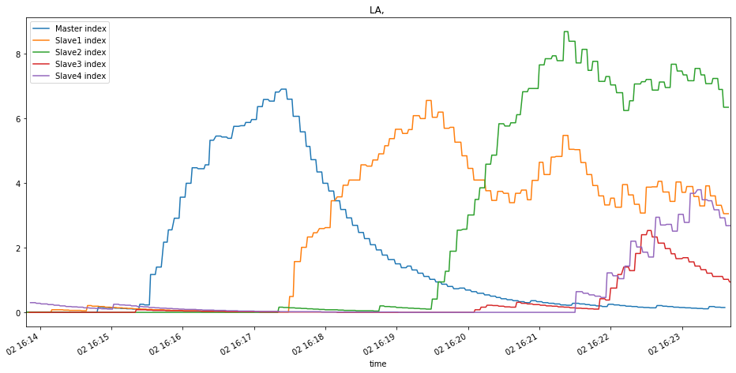
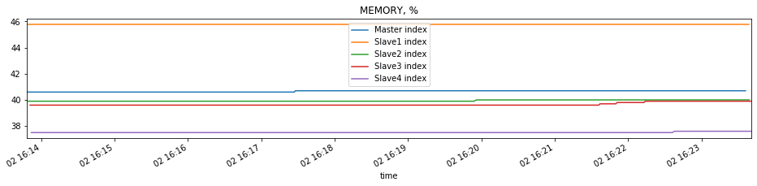

### LA(Load Average)



### Memory



### Test Description

- First two minutes works only master
- 2 minutes master works along with 1 replica
- 2 minutes master works along with 2 replicas
- 2 minutes master works along with 4 replicas

---

All queries for prefix searching go to replica, if it exists.

All other queries go to master.

---

20% of queries are prefix searches.

80% of queries are on /search page without parameters.

---

The load command:
```bash
>>> wrk -t1 -c50 -d500 --timeout 30 -s scripts.lua  http://localhost:8080
```
